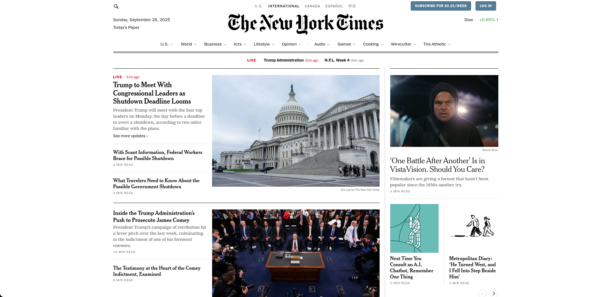
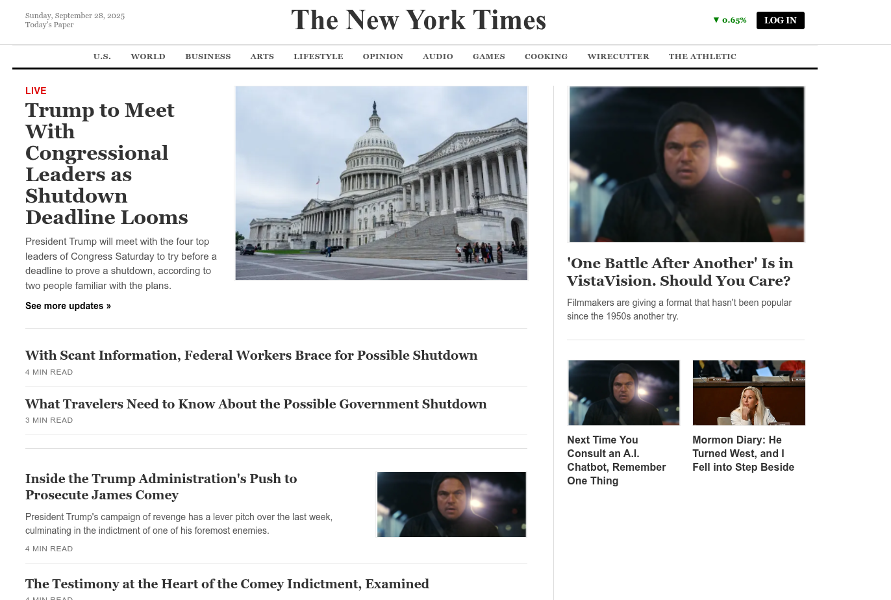
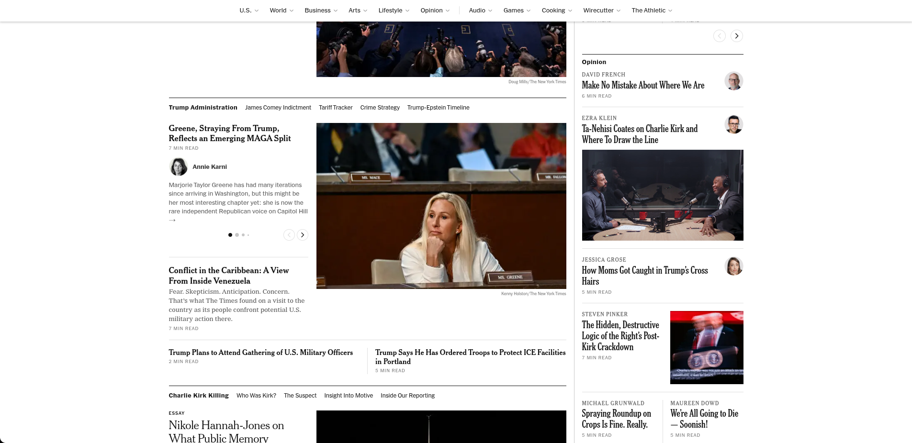
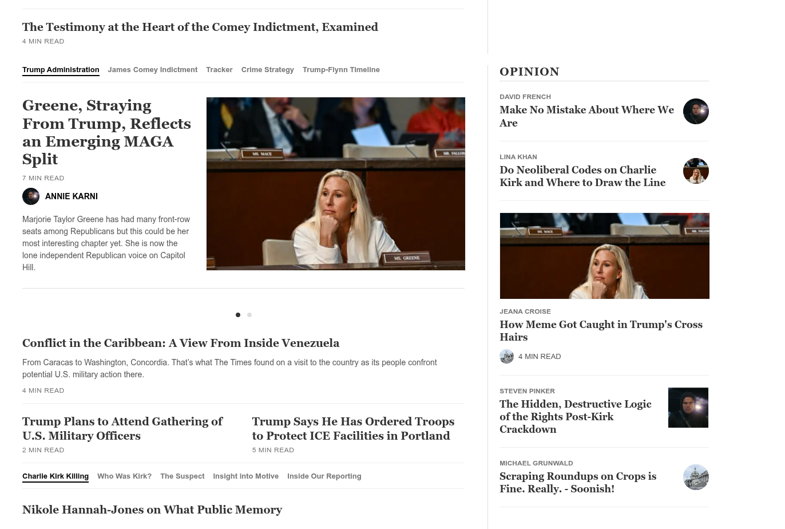
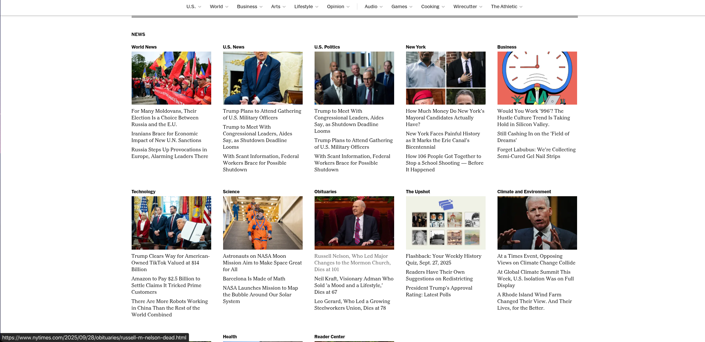

# 📰 The New York Times - Homepage

A detailed, static **HTML and inline CSS** recreation of a typical The New York Times homepage. This project serves as an exercise in **front-end development**, focusing on replicating a complex newspaper layout using modern web design techniques like **CSS Grid** and **Flexbox**, all implemented directly through `style` attributes.

---

## 🔗 Project Links

- **GitHub Repository:** [Bishwajit-2810/The_New_York_Times](https://github.com/Bishwajit-2810/The_New_York_Times)
- **Live Demo:** [https://bishwajit-2810.github.io/The_New_York_Times/](https://bishwajit-2810.github.io/The_New_York_Times/)

---

## ✨ Features

- **Authentic Design:** Mimics the distinctive look of The New York Times with classic **serif typography** (`Georgia`/`Times New Roman`) and a restrained, newspaper-style color palette.
- **Structured Layout:** Uses a multi-part layout (**header**, **nav**, **main content**, and **footer**) to separate concerns.
- **Responsive Grid:** The main content section utilizes a **two-column grid** (2/3 for news, 1/3 for opinion/features). The bottom news section features a responsive card grid to display various categories.
- **Inline Styling Focus:** All presentation logic is contained directly within the HTML's **`style` attributes**, showcasing proficiency with atomic styling or email-template-like construction.

---

## 🖼️ Image Comparison

To illustrate the project, this table compares the original design (from `original_page`) to the final output (from `build`).

|       Original Page Reference (`original_page/`)        |                  Final Built Page (`build/`)                  |
| :-----------------------------------------------------: | :-----------------------------------------------------------: |
|     |                         |
|     |                      |
|     |                      |
| _Note: Assets are sourced from the respective folders._ | _The live preview above shows a rendering of the final HTML._ |

---

## 💻 Technology Stack

- **HTML5** (Structure)
- **Inline CSS** (`style` attributes for presentation, including Flexbox and CSS Grid)

---

## 🚀 Usage and Setup

To run this project, simply save the provided HTML content and open it in a web browser. The core image assets required for local display are located in the **`images`** directory (as referenced in `index.html`).

1. **Clone the repository:**

   ```bash
   git clone https://github.com/Bishwajit-2810/The_New_York_Times
   cd The_New_York_Times
   ```

2. **File Structure Check:** Ensure the following directory structure is maintained:

   ```
   .
   ├── build/             # Final output/screenshot images
   ├── images/            # Images used by index.html (1.png, 2.png, 3.png, 4.ico)
   ├── index.html         # The main project file
   └── original_page/     # Reference images
   ```

3. **Open in Browser:** Double-click `index.html` or drag the file into your preferred web browser.

---

## 👤 Author

**Bishwajit Chakraborty**

- Student ID: **1414**
- Student Section: **63_B1**
- GitHub: [@Bishwajit-2810](https://github.com/Bishwajit-2810)
- Portfolio: [https://bishwajit-2810.github.io/](https://bishwajit-2810.github.io/)
- LinkedIn: [Bishwajit Chakraborty](https://www.linkedin.com/in/bishwajit-chakraborty/)

---

## 📜 License

This project is a design exercise created by **Bishwajit Chakraborty** and is not affiliated with The New York Times Company. All rights and trademarks belong to their respective owners.

**© 2025 The New York Times Company (Bishwajit Chakraborty). All rights reserved.**
